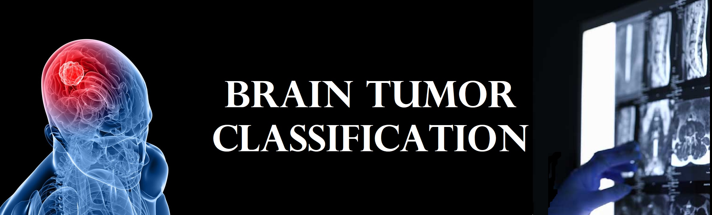

## Motivation and objectives
The brain is a major organ of the human body that controls all the body’s functions. 
A brain tumor is the growth of abnormal cells in the brain. There exist many types of 
brain tumors. Some are cancerous (malignant) and others are noncancerous (benign). 
The growth rate and the location of a brain tumor determine how the function of the 
nervous system will be affected. As the brain is the control center of the body, 
more than any other cancer, brain tumors can have lasting and life-altering physical, 
cognitive, and psychological impacts on a patient’s life.

A formal diagnosis of a brain tumor takes multiple steps. A series of tests will be
undergone based on the symptoms, the location and the nature of the tumor, and the
patient’s health history. The diagnosis usually starts with magnetic resonance imaging
(MRI). When the MRI scans show the presence of a brain tumor, a sample of the
tumor’s tissue (a biopsy) is usually needed to determine the type of brain tumor.
However, manually reviewing the MRI scans is time-consuming and also prone to
human error.

The goal of this project is to use machine learning techniques to determine the types 
of brain tumors from MRI scans. The diagnosis time is then shortened and the doctors
can proceed with the treatment plan earlier. We will use deep learning algorithms to
build a convolutional neural network as our predictive model. We will also explore the
transfer learning technique to build several convolutional neural networks based on the
pre-trained models.

## Data source
This [dataset](https://www.kaggle.com/sartajbhuvaji/brain-tumor-classification-mri) is taken from Kaggle.com for this project.

It contains 2870 MRI images of the brain in the training dataset and 394 images in the testing dataset.  Our task is to classify the MRI images into four types of brain tumors – glioma tumor, meningioma tumor, pituitary tumor, and no tumor.  

## Project directories
- [notebooks](https://github.com/szelinghsu/BrainTumor/tree/main/notebooks) contains
  - [brain_tumor.ipynb](https://github.com/szelinghsu/BrainTumor/blob/main/notebooks/brain_tumor.ipynb) for a baseline 2-layers CNN model
  - [brain_tumor_transfer_learning_EfficientNetB1.ipynb](https://github.com/szelinghsu/BrainTumor/blob/main/notebooks/brain_tumor_transfer_learning_EfficientNetB1.ipynb) for a model based on EfficientNet_B1 model
  - [brain_tumor_transfer_learning_EfficientNetB1_image_preprocessing.ipynb](https://github.com/szelinghsu/BrainTumor/blob/main/notebooks/brain_tumor_transfer_learning_EfficientNetB1_image_preprocessing.ipynb) for a model based on EfficientNet_B1 model with image preprocessing
  - [performance_comparision.ipynb](https://github.com/szelinghsu/BrainTumor/blob/main/notebooks/performance_comparision.ipynb) for model performance comparison
- [report](https://github.com/szelinghsu/BrainTumor/tree/main/report) contains 
  - [Brain Tumor Classification Final Report.pdf](https://github.com/szelinghsu/BrainTumor/blob/main/report/Brain%20Tumor%20Classification%20Final%20Report.pdf) the final project report
  - [Brain Tumor Classification Presentation Slides.pdf](https://github.com/szelinghsu/BrainTumor/blob/main/report/Brain%20Tumor%20Classification%20Presentation%20Slides.pdf) the project presentation slides
  
